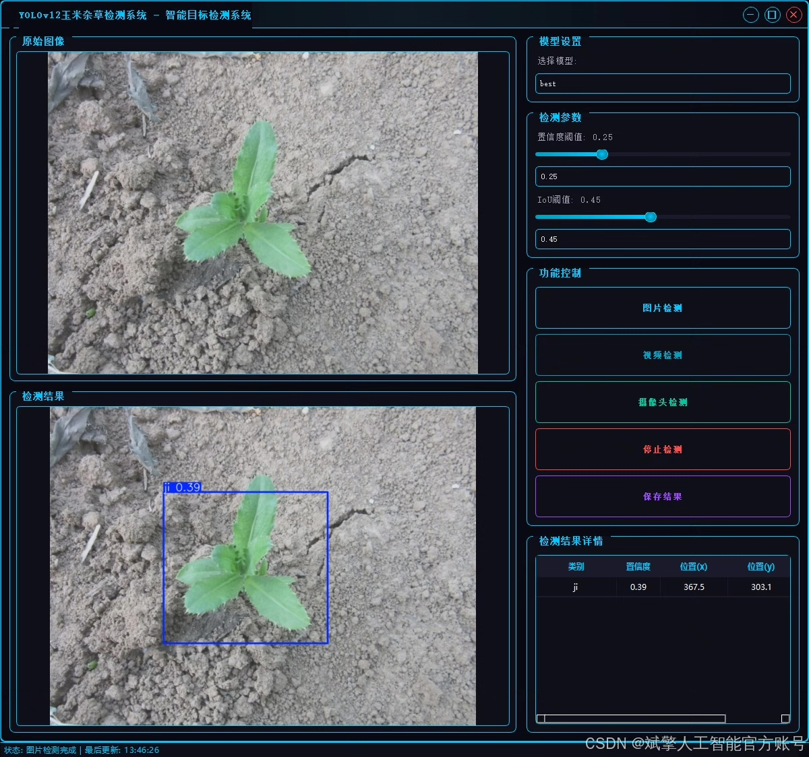
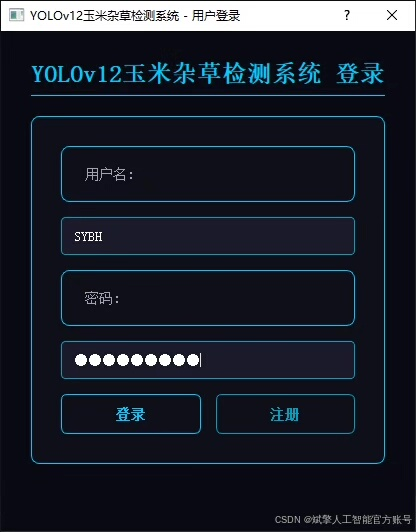
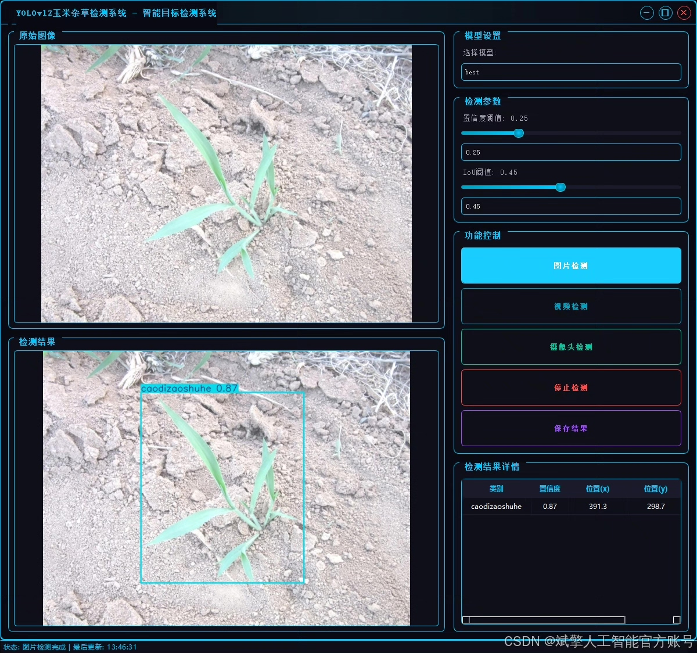
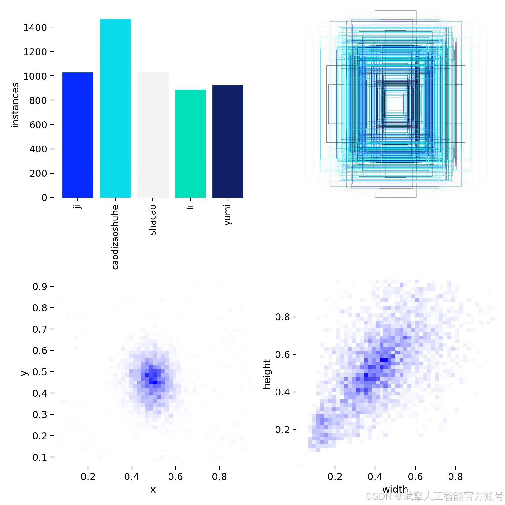
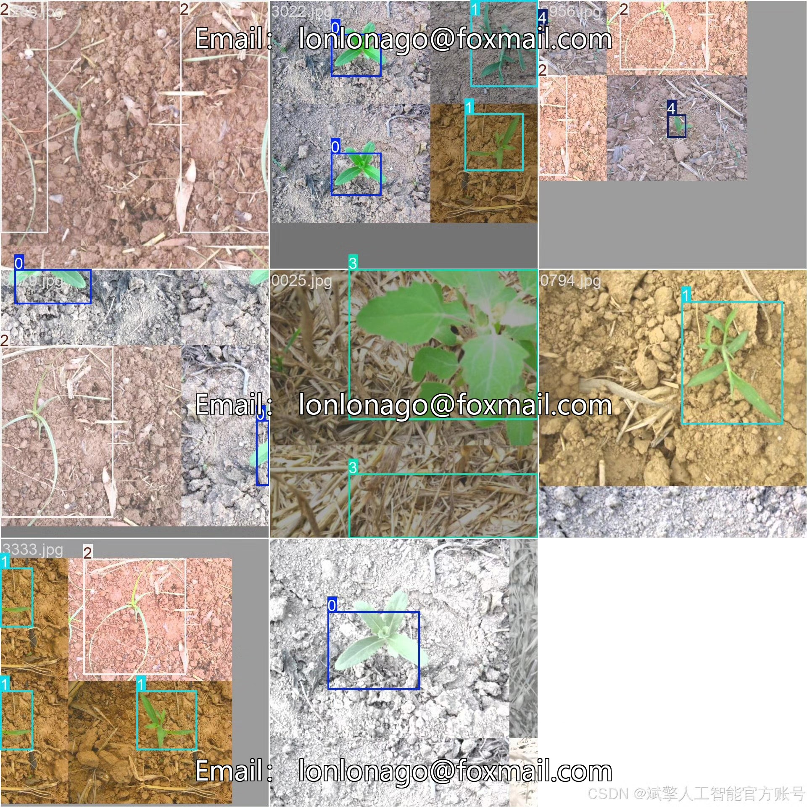
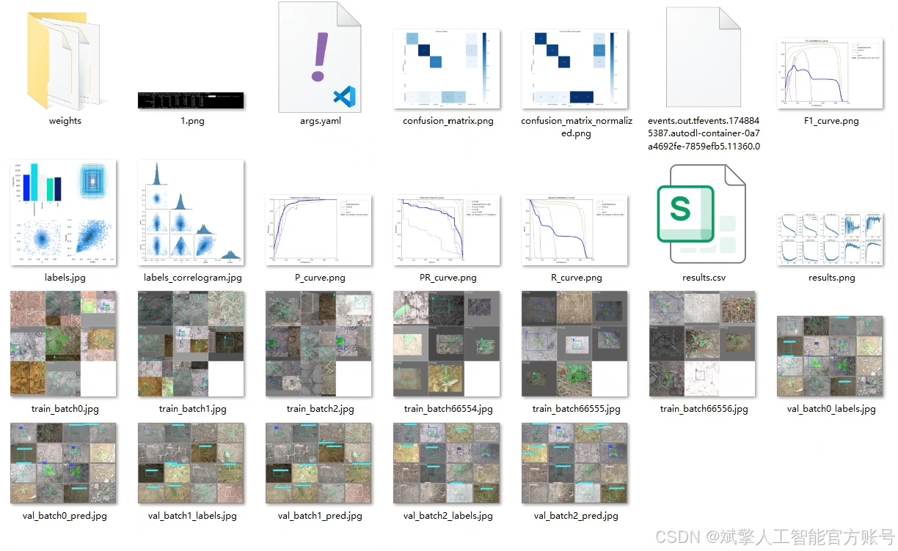
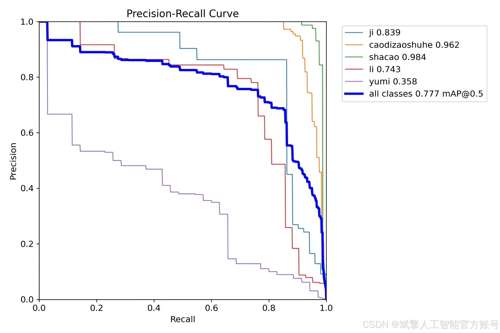
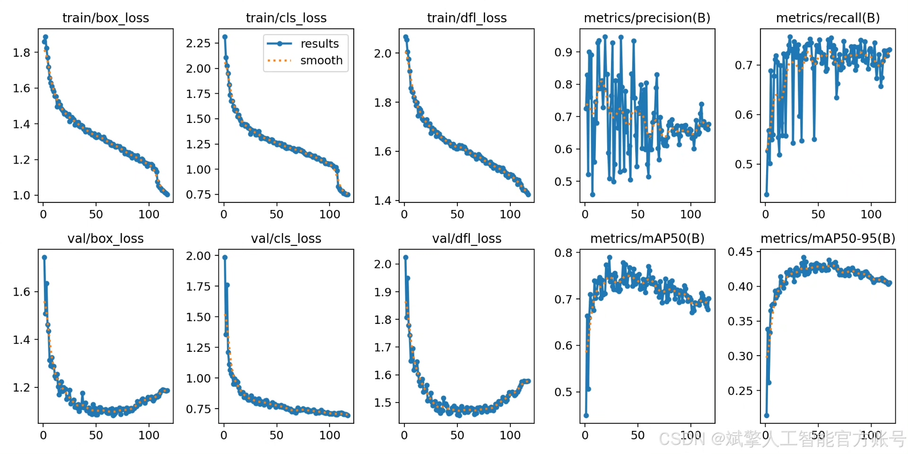
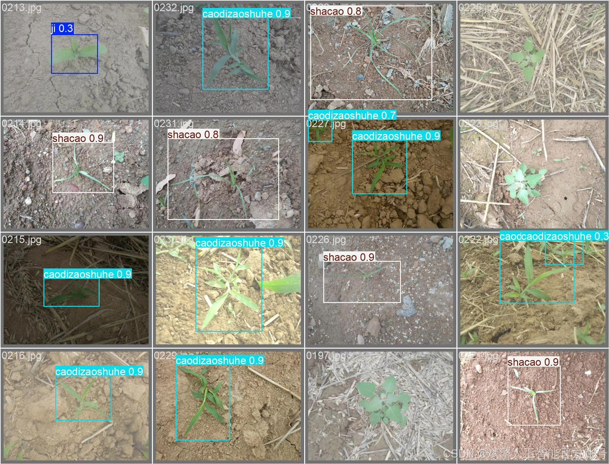

# YOLOv12 weed detection system

## Body

YOLOv12 Weed Detection System Based on Deep Learning YOLOv12: A Weed Identification and Detection System (YOLOv12+YOLO dataset + UI interface + login registration interface + Python project source code + model)

This paper designs and implements a weed identification and detection system based on the deep learning YOLOv12 algorithm, targeting five categories of targets in agricultural scenarios (thistle, tall fescue, sedge, quinoa, and corn). The system is developed using Python, including a complete implementation of the YOLOv12 model, training process, and user interaction interface. In terms of data collection, a total of 5,283 labeled images were collected, with 4,971 for training and 312 for validation, ensuring the model has good generalization capabilities. Technologically, the system integrates the YOLOv12 object detection algorithm, enhancing the accuracy of small-object weed detection through multi-scale feature fusion and attention mechanisms. Application layer development includes a UI interface with login registration functions, supporting user management, real-time detection, and result visualization, meeting the needs of real-time monitoring of weeds in precision agriculture. It provides a reusable technical solution for intelligent agricultural research.

✅ User Login Registration: Supports password verification and security validation.
✅ Three detection modes: Based on the YOLOv12 model, supports image, video, and real-time camera detection, accurately identifying targets.
✅ Dual-screen comparison: Display original images and detection results on the same screen.
✅ Data visualization: Real-time table displaying the category, confidence, and coordinates of detected targets.
✅ Intelligent parameter adjustment: Offers a confidence slide bar to dynamically optimize detection accuracy, adapting to different scene requirements.
✅ Sci-fi style interactive interface: Dark theme combined with dynamic light effects, reducing visual fatigue and improving operational experience.

## Images

## Payment

Here is a pay link on Stripe ( https://buy.stripe.com/3cs8yP7sY87d0vu9AB ). Please contact me lonlonago@foxmail.com after funding $89, and I will send you a complete data files , thank you!

